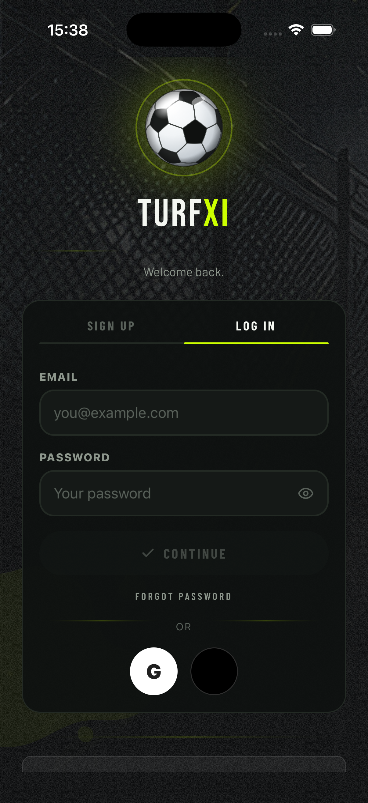

# TurfXI

**An app for running a Sunday-league football team.** Fixtures, who's playing,
live match events, player ratings, team of the week, subs collection.

### ▶ [Try the live demo](https://sayamdev.github.io/turfxi-demo/)

No sign-up. Click **Explore the demo club** and you're in a club with a full
season already played.

---

## Things to try in the demo

- **Home** — what the club needs to do next
- **Fixtures** — a match, who's in, who's out, the waiting list
- **Match** — record goals and cards as they happen
- **Ratings** — rate teammates after the whistle, see the consensus
- **Stats** — season records, form, team of the week

---

## Built with

React Native (Expo) · TypeScript · Postgres on Supabase · GitHub Actions

Runs on iOS and Android. The demo above is the same app compiled for the web.

---

## A few things I'm proud of

**It works with no signal.** Every phone keeps a full copy of the club. Screens
never wait on the network — there isn't a single loading spinner in the app.
Changes queue up and sync when the signal comes back.

**Security is in the database, not the app.** Anyone can pull apart an installed
app, so the rules live in Postgres where a modified app can't reach them. I
found and fixed a hole that let any club member make themselves an admin, then
wrote a test that signs in as two real users and proves it's closed.

**It's tested.** 950 assertions covering the rules that matter — who can set a
lineup, when voting closes, how a record gets beaten. Five checks run on every
push and finish in about 90 seconds.

---

## What's in this repo

A working demo, a handful of source files worth reading, and screenshots. It's
a sample rather than the product — the full app is private.

| | |
|---|---|
| `demo/` | the live site above |
| `code/` | selected source, with notes in `NOTES.md` |
| `screenshots/` | |

Happy to walk through any of it.
